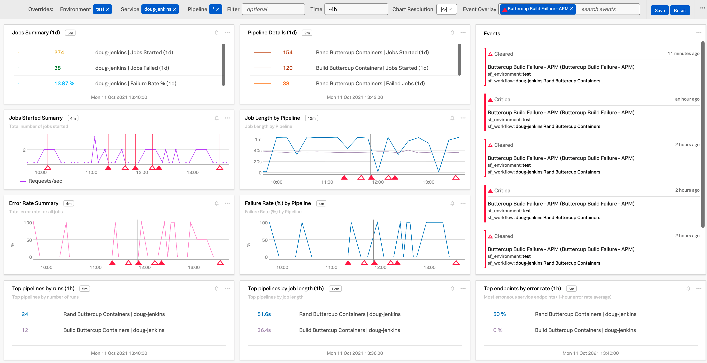
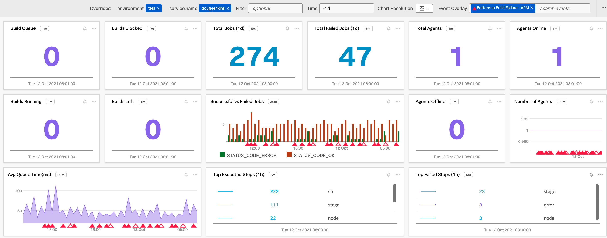

# Jenkins-OTEL-Notes-Gists

1. How can we use the Jenkins OTEL plugin to GDI to Splunk?
    - [Jenkins OTEL plugin](https://plugins.jenkins.io/opentelemetry/#getting-started) can be used with an [OTEL collector](https://github.com/signalfx/splunk-otel-collector) to send to SFX APM, SFX Log Observer, and Splunk HEC
        - Quick linux install: 
            ```
              curl -sSL https://dl.signalfx.com/splunk-otel-collector.sh > /tmp/splunk-otel-collector.sh && \
              sudo sh /tmp/splunk-otel-collector.sh --realm $SPLUNK_REALM -- $SPLUNK_ACCESS_TOKEN
            ```
    - For traditional Build Logs would want to run an OTEL agent on the Jenkins instance and send logs through OTEL

2. What does the OTEL config look like? 
    - Can setup for just HEC, just Log Observer, or BOTH. Config below is for both
    1. Config for [Splunk Otel Variables](./splunk-otel-collector.conf) (default location on instance is `/etc/otel/collector/splunk-otel-collector.conf`)

    2. Config for [OTEL Agent](./agent_config.yaml) (default location on instance is `/etc/otel/collector/agent_config.yaml`)
        - Pay special attention to the additional `environment` attribute / tag we're adding to each trace. SignalFX APM utilizes this attribute by default
            ```
            attributes:
              actions:
              - key: environment
                value: test
                action: insert
            ```
        - Also pay attention to the dual exporters for our logs. One sending to SFX Log Observer and the other to HEC for Splunk Enterprise
            ```
            # Logs
            splunk_hec/log_observer:
              token: "${SPLUNK_ACCESS_TOKEN}"
              endpoint: "${SPLUNK_LOGOBSERVER_URL}"
              source: "otel"
              sourcetype: "otel"
            splunk_hec:
              token: "${SPLUNK_HEC_TOKEN}"
              endpoint: "${SPLUNK_HEC_URL}"
              source: "otel"
              sourcetype: "otel"
            ```
        - Finally we use both of these in our service pipelines for traces (and logs)
            ```
            service:
              extensions: [health_check, http_forwarder, zpages, memory_ballast]
              pipelines:
                traces:
                  receivers: [jaeger, otlp, smartagent/signalfx-forwarder, zipkin]
                  processors:
                  - memory_limiter
                  - attributes  
                  - batch
                  - resourcedetection
                  #- resource/add_environment
                  exporters: [sapm, signalfx, splunk_hec, splunk_hec/log_observer]
            ```
3. OTEL collector is setup. I've installed the Jenkins OTEL plug using the Jenkins Plugin Manager. How do I configure the Jenkins OTEL plugin?
    - Add your OTEL Collector Instance's IP and the appropriate port to the `OTLP GRPC ENDPOINT` field in Manage Jenkins > Configure System.  
        - Default port: `4317`
        -  Verify open ports on the box:
            ```
            # sudo netstat -tulpn | grep LISTEN        
            tcp6    0   0 :::22         :::*        LISTEN   507/sshd            
            tcp6    0   0 :::9943       :::*        LISTEN   9768/otelcol        
            tcp6    0   0 :::8888       :::*        LISTEN   9768/otelcol        
            tcp6    0   0 :::9080       :::*        LISTEN   9768/otelcol        
            tcp6    0   0 :::14268      :::*        LISTEN   9768/otelcol        
            tcp6    0   0 :::4317       :::*        LISTEN   9768/otelcol      
            tcp6    0   0 :::55681      :::*        LISTEN   9768/otelcol        
            tcp6    0   0 :::9411       :::*        LISTEN   9768/otelcol  
            ```

    - Settings in Jenkins Otel Collector  
        ```
        **OTLP GRPC Endpoint**: http://34.125.182.158:4317
        **Authentication**: No Authentication
        **Visualisation**:
            - **Custom Observability Backend**
                - **Name**: `Splunk APM (SignalFX)`
                - **Trace visualisation URL template**: https://app.us1.signalfx.com/#/apm/traces/${traceId}
        ```

4. Once traces are going in you should see your Jenkins Instance as an APM Service.   
    - Each of the Pipelines running in Jenkins will be treated as a Service Endpoint
    - A basic [SFX Jenkins dashboard](./dashboards/Jenkins-Service-Endpoint-OTEL-APM.json) is also available as a starting point
        1. Filter by your environment variable
        2. Filter by your Jenkins Service Name
        3. Filter by your Pipeline (or * for all pipelines)
        4. Edit Event Overlay to match detectors (I.E. Detector for build failures)
    

5. Log Observer can be leveraged to help get a better overview of our Overall Jenkins Health
    - For step and job success information [enable these metrics through Log Observer](./images/Jenkins-LogObserver-Setup.png).
        1. Ingest your logs into Log Observer (see above OTEL configuration files)
        2. Create metrics for `jenkins.run.status` and `jenkins.pipeline.step.status`
            - For `jenkins.run.status`:  
            ```
            Matching Condition: attributes.ci.pipeline.id=*
            Operation: count
            Dimensions: ["status.code","attributes.ci.pipeline.id","service.name","environment"]
            ```
            - For `jenkins.pipeline.step.status`:
            ```
            Matching Condition: attributes.jenkins.pipeline.step.name=*
            Operation: count
            Dimensions : ["attributes.jenkins.pipeline.step.type","status.code","environment","service.name"]
            ```
    1. Filter by environment
    2. Filter by Service Name
    3. For status indicators on charts add your Detector to the Event Overlay
    


